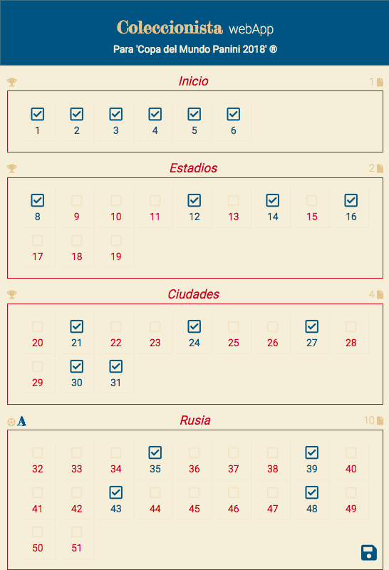
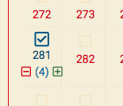
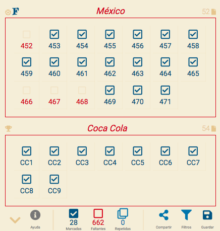
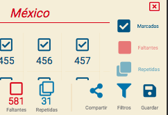
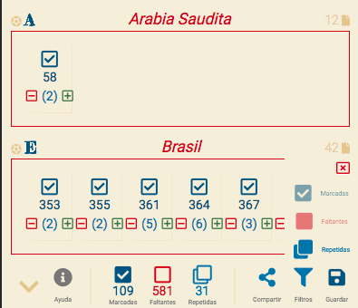
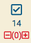

# Coleccionista webApp
#### Para álbum 'Copa del Mundo Panini 2018' ®

### **v0.8** [Album collector](https://softwarenacho.github.io/collector/)

###### AngularJS con el objetivo de convertirse en una aplicación progresiva, probada y funcionada en Web, iOS y Android.

Usando una estructura similar a la estructura del álbum físico con clasificación por página, grupo y equipo, con interfaces orientadas a la usabilidad, usando la paleta de colores oficiales, y el mínimo de elementos visibles a la vez manteniendo la aplicación en una página

**v0.5 (2018-05-20)** El primer avance consiste en marcar el diseño, la estructura, la primera arquitectura, y la mínima funcionalidad, logrando lo siguiente:
  - Se ejecuta un guardado local para preservar las cartas
  - 

**v0.5.1 (2018-05-20)** Se presenta la funcionalidad de duplicados que fue casi completa en el commmit anterior pues su estructura ya estaba realizada en el diseño de las clases
  - Ajustes visuales al diseño anterior, se agregan ambas funcionalidades
  - Los duplicados ya estaban considerados en la versión anterior del controlador, funcionaron
  - 

**v0.5.2 (2018-05-21)** Agregada toolbar con las siguientes opciones: Ayuda, Compartir, Filtro, también se agregan las siguientes estadisticas: Marcadas, Faltantes, Repetidas
  - 
  - Caja de filtros (Marcadas, Repetidas, Faltantes):
  - 
  - Lógica de filtrado que oculta/desoculta las cartas/grupos dependiendo de su activación, aún no funciona con combinaciones complejas.
  - 
  - Las repetidas no pueden ser negativas

**v0.7.5 (2018-05-21)**
  - Desarrollado el método para guardar en DB por medio de un api en RAILS5 [(nacho-api)](https://github.com/softwarenacho/nacho-api)
  - Modificado el compartamiento al guardar, ahora los cambios locales se guardan inmediatamente y el botón activa el pedido al api

**v0.8 (2018-05-23)**
  - Agregado usuario con las siguientes caracteristicas, todas ellas consumen API:
    - Registro de usuarios
    - Log In los cambios son leeidos de DB (Sobreescriben el local)
    - Cambio del nombre asignado por default
    - Registro de pin
    - Log out
  - Implementado manifesto

### To do:

- **v0.5.1** ~~DUPLICADOS: Visualizar (hay un avance oculto con declaración de intencions en el primer commit) y funcionalidades ( agregar quitar ...)~
-  **v0.5.2** ~~Mostrar información de totales ( cartas marcadas, restantes,  repetidas, totales )~~ No se agregó totales
  - 
- **v0.5.2** ~~Barra inferior de herramientas con las siguientes funcionalidades~~
  - Compartir lista con amigo por código ( comparar: diferencias generales, repetidas que no tengo, viceversa )
  - **v0.5.2** ~~Filtrados rápidos a la lista ( pais, pag, marcadas, desmarcadas . . . )~~ No se agregó filtro por país
  - Ayuda que muestra el modal de tutorial
- **v0.7.5** ~~Conexión a DB para preservar la información local y expandir las funcionalidades online~~
- **v0.8** ~~Publicar versión del primer commit~~
- **v0.8** ~~Usuarios para ampliar la opciones de compartir~~ No hay compartir sólo usuarios
- **v0.8** ~~Pin de usuario (después de usuario)~~
- Agregar tutorial con el funcionamiento básico de la app
- Modos de visualización ( minima sin paises, sólo numerados, lista con detalles )
- **v0.8** ~~Implementar manifiesto~~
- Implementar service workers
- Busqueda rápida con resultados visuales
- Botón para deshacer acción
- Navegación rápida
- Comparar cambios entre la versión en línea y la local
- Cambiar pin (botón deshabilitado)
- Modo inverso para las faltantes
- Spinners en cargas
- Modo navegación ( saltar entre páginas o paises )
- Visualización: if card > 10 width sólo 5

### Bugs:

- Doble click en mobile ~~**v0.7.5**~~v.0.8
- **v0.5.2** ~~Repetidas se pueden llevar a menos de 0~~

#### Validaciones:
 - Diferencias para activar/ocultar el botón de guardado
 - No guardar si está vacío
